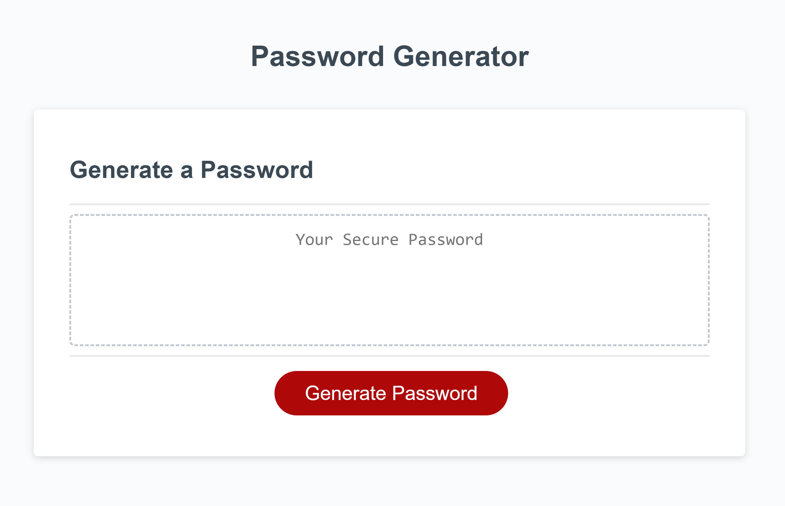

# Random Password Generator

This is a simple web application that generates random passwords based on user-defined criteria. The generated passwords can include lowercase letters, uppercase letters, numeric characters, and special characters.

## Table of Contents

- [Usage](#usage)
- [How It Works](#how-it-works)

## Usage

To use the password generator, follow these steps:

1. Open the application in your web browser.
2. Click the "Generate Password" button.
3. Enter the desired password length (between 8 and 128 characters).
4. Select at least one character type (lowercase, uppercase, numeric, or special characters).
5. Your randomly generated password will be displayed on the screen.

## How It Works

The password generator uses JavaScript to create passwords based on user input. It offers a variety of character types and ensures that at least one type is selected before generating the password.
